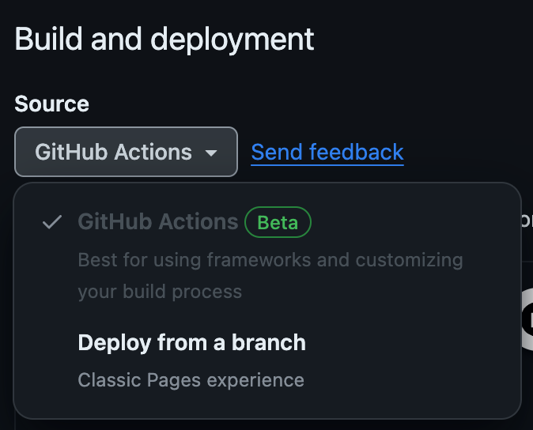
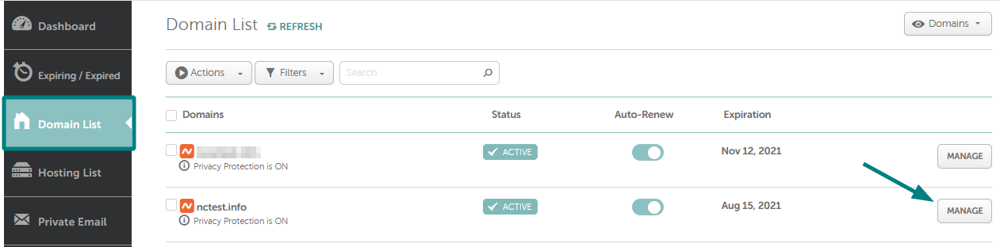
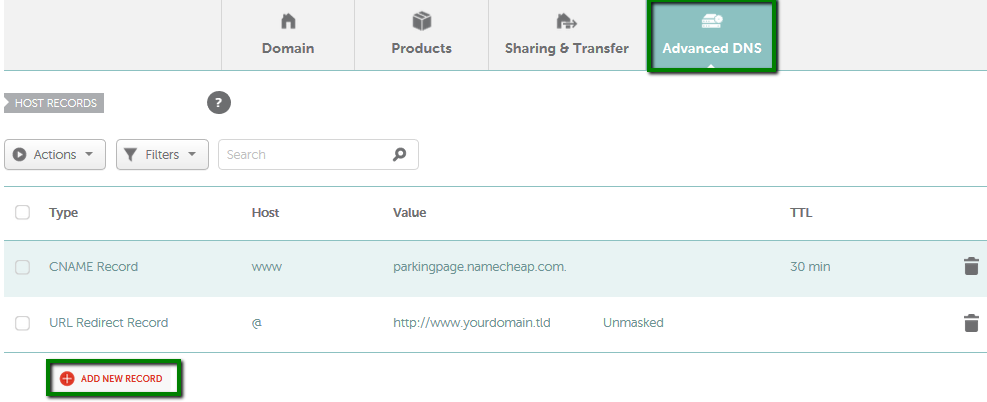

<style>
  aside {
    width: 40%;
    padding-left: 0.5rem;
    margin-left: 0.5rem;
    float: right;
    box-shadow: inset 5px 0 5px -5px #29627e;
    font-style: italic;
    color: #29627e;
  }

  aside > p {
    margin: 0.5rem;
  }

  summary {
    font-weight: bold;
    font-size: 1.1em;
  }

  details > summary {
    list-style-type: '✅ ';
    color: #666666;
  }

  details[open] > summary {
    list-style-type: '🟩 ';
    color: #333333;
  }
    table {
      margin-left: 30px;
    }
  </style>

</style>


When starting a project, it is critical to have a professional looking site. This is especially true for a startup like [CodeBlind][codeblind]. The site needs to be secure, fast, and easy to maintain.

Additionally, until we have funding, we need to keep costs low. This means we need to use free services as much as possible.

> This goal of this post is to configure your [Vue 3][vue3] SPA github project as a [Github Page][github-pages] - using a real domain name from [namecheap][namecheap] - then automating deployment using [Github Actions][github-actions] to build and deploy the site automatically. Let's get started.


## Prerequisites

<details open>
  <summary>1. Register a Domain</summary>

  > I registered a domain on [Namecheap][namecheap]. There are a number of great domain registrars, but I have been using Namecheap for a while. They have great prices and a good reputation. You can read a comparison of [Namecheap and GoDaddy on Forbes][namecheap-comparison].

</details>

<details open>
  <summary>2. Create a Vue 3 SPA</summary>

  > I am using using [Vue 3][vue3] and [Vite][vite] to create the site. A quick look at the [Vite Quick Start][vite-bootstrapping] should allow you to generate your site in a few minutes. 
</details>

## Why Github Pages?

*Let's start with facts, startups have no money until there is funding.* Before then, we need to setup a site that is free to host and easy to maintain. It also supports custom domains, which is a must for a professional site. And we need to be able to automate the build and deployment process, so we can focus on the product.


### 1. Setting up Github Pages
The first step to publishing an SPA is to create a new repository on Github. Assuming you already have one, we next need to enable Github Pages for the repository. 

<details open>
  <summary>1.1 Ensure your repository is <code>public</code></summary>

  GitHub Pages is designed to host your personal, organization, or project pages from a GitHub repository. Thus validate the repository is public. 
  
  By making the site public we achieve two things:
  1. We avoid the cost of a subscription. 
  2. We contribute to the open source community, which is a good thing. Note, for SPA is generally is trivial to reverse engineer the code so there is little risk in making the code public IMHO. The real value of the site is the data and the services it provides.
   
  If not already public, click the `Change visibility` button at the bottom of the General Settings.
</details>

<details open>
  <summary>1.2 Ensure your repository name is correct</summary>
  For the site to be hosted on Github Pages, the repository name must be in the format `username.github.io` where `username` is your Github username or organization name.
</details>

<details open>
  <summary>1.3 Update Build and deployment setting</summary>
  
  In the <code>Pages</code> section of the repository settings, ensure the <code>Source</code> is set to <code>Github Actions</code> in the Build and deploy section.

  

  <br/>

  The remainder of the configuration can remain the same for now.

</details>

### 2. Configuring Github Actions

<details open>
  <summary>Create your Github Actions Workflow</summary>

  Github Actions is a powerful tool that allows you to automate your software development workflows. We will use it to build and deploy our site to Github Pages.

  To get started, create a new file in the `.github/workflows` directory of your repository. You can name the file anything you like, but I will use `deploy.yml` for this example.

  > Depending on the framework you are using, you may need to configure the build and deployment process for github actions. There are a number of [templates][workflow-templates] available.


  We are using [Vue 3][vue3] and [Vite][vite] so we will use the following workflow:

```yaml
# Simple workflow for deploying static content to GitHub Pages
name: Deploy static content to Pages

on:
  # Runs on pushes targeting the default branch
  push:
    branches: ["main"]

  # Allows you to run this workflow manually from the Actions tab
  workflow_dispatch:

# Sets the GITHUB_TOKEN permissions to allow deployment to GitHub Pages
permissions:
  contents: read
  pages: write
  id-token: write

# Allow one concurrent deployment
concurrency:
  group: "pages"
  cancel-in-progress: true

jobs:
  # Single deploy job since we're just deploying
  deploy:
    environment:
      name: github-pages
      url: ${{ steps.deployment.outputs.page_url }}
    runs-on: ubuntu-latest
    steps:
      - name: Checkout
        uses: actions/checkout@v4
      - name: Set up Node
        uses: actions/setup-node@v3
        with:
          node-version: 18
          cache: "npm"
      - name: Install dependencies
        run: npm install
      - name: Build
        run: npm run build
      - name: Setup Pages
        uses: actions/configure-pages@v3
      - name: Upload artifact
        uses: actions/upload-pages-artifact@v2
        with:
          # Upload dist repository
          path: "./dist"
      - name: Deploy to GitHub Pages
        id: deployment
        uses: actions/deploy-pages@v2
```

  > Note that I am deploying directly from the `main` branch. I believe in ship early and ship often. 🚀 
  > 
  > This is a personal choice and you may want to deploy from a `release` branch or `tag`. In a later post, I will cover setting up the PR and `post-deploy` testing pipeline to ensure we can build confidence in the changes before deploying to production. 
  
  One final step is visit your site and ensure it is working. You can do this by visiting `https://username.github.io` where `username` is your Github username or organization name.
  
  > Click on the actions tab to see the progress of the deployment. If there are any issues, you can click on the failed job to see the logs and debug the issue.
  >
  > Another really great side effect of this is that we don't have to buy a domain certificate. Github Pages is served over HTTPS by default. *This is a huge win.* 🎉

</details>

### 3. Customizing your Domain
Now that everything is working, we want to setup our custom domain to our branded domain.

This work will happen in two parts, one phase on [Namecheap][namecheap] and the other on Github.

#### 3.1 Setting up DNS on Namecheap

<details open>
  <summary>Setup the DNS on Namecheap.</summary>
  
  1. **[Sign in](https://www.namecheap.com/myaccount/login.aspx) to your Namecheap account.**
  
  2. **Select Domain List from the left sidebar and click on the Manage button next to your domain name:**
  
  
  
  3. **Navigate to the Advanced DNS tab and click on the Add New Record button:**
  
  
  
  1. **Add the following records to your domain:**

  <table>
    <tr>
      <th>Type</th>
      <th>Host</th>
      <th>Value</th>
      <th>TTL</th>
      <th>Notes</th>
    </tr>
    <tr>
      <td>A</td>
      <td>@</td>
      <td>185.199.108.153</td>
      <td>Automatic</td>
      <td>Github IP</td>
    </tr>
    <tr>
      <td>A</td>
      <td>@</td>
      <td>185.199.109.153</td>
      <td>Automatic</td>
      <td>Github IP</td>
    </tr>
    <tr>
      <td>A</td>
      <td>@</td>
      <td>185.199.110.153</td>
      <td>Automatic</td>
      <td>Github IP</td>
    </tr>
    <tr>
      <td>A</td>
      <td>@</td>
      <td>185.199.111.153</td>
      <td>Automatic</td>
      <td>Github IP</td>
    </tr>
    <tr>
      <td>CNAME</td>
      <td>www</td>
      <td><code>username</code>.github.io</td>
      <td>Automatic</td>
      <td>Replace <code>username</code> with your actual GitHub account username</td>
  </table>

  > ***Note 1:*** delete the other records that are there by default. We only need the records above for now. 🗑️
  >
  >  ***Note 2:*** you may have to wait for DNS to update. It can take up to 30 minutes - so now is a great time to brew a cup of tea. ☕

</details>

#### 3.2 Defining the Custom Domain on Github
<details open>
  <summary>Configure the custom domain on Github</summary>

  Now that the DNS is setup, we need to tell Github to use the custom domain.
  
  1. **Navigate to the repository settings and scroll down to the `Github Pages` section.**
  2. **Add your custom domain to the `Custom domain` input.** This should be in the form of `yourdomain.com` or `www.yourdomain.com` depending on your preference.
  3. **Click `Save` to save the changes.**
  
  At this point Github will validate the domain and if everything is setup correctly, your site will be available at your custom domain.
  
  There is a small context text area that will show you the status of the domain validation. If there are any issues, may want to look back at your Namecheap DNS configuration.
  
  **That's it! It should now be live and visible at your custom domain.** 🎉
</details>

### Summary

In this post, we have setup a site for our startup. We have used free services to keep costs low and automated the deployment process to ensure we can focus on the product.

In the next post, we will look at how we might link two sites under the same domain to add allow us to have different projects, one for the landing page and docs - providing SEO support, and one for our application which we deployed above! Until then, be excellent to each other, and have great day! 🚀

<!-- Links -->
[auth0]: https://auth0.com/
[codeblind]: https://codeblind.ai/
[codeblind-app]: https://app.codeblind.ai/
[github-actions]: https://docs.github.com/en/actions
[github-pages]: https://pages.github.com/
[hugo]: https://gohugo.io/
[namecheap]: https://www.namecheap.com/
[namecheap-comparison]: https://www.forbes.com/advisor/business/namecheap-vs-godaddy/
[vue3]: https://v3.vuejs.org/
[vite]: https://vitejs.dev/
[vite-bootstrapping]: https://vitejs.dev/guide/#scaffolding-your-first-vite-project
[workflow-templates]: https://github.com/actions/starter-workflows/tree/main/pages